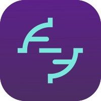

# [](https://www.bitrise.io/add-ons/trace-mobile-monitoring) trace-android-sdk
[](https://twitter.com/bitrise)
[](https://chat.bitrise.io/)
[](https://search.maven.org/artifact/io.bitrise.trace.plugin/trace-gradle-plugin/)
[](https://search.maven.org/artifact/io.bitrise.trace/trace-sdk/)
[](https://codecov.io/gh/bitrise-io/trace-android-sdk)

Catch bugs before they reach production — get detailed crash reports and monitor how your app is 
performing across the entire install base. When issues are detected we show you exactly what 
happened during the user session to locate, reproduce, and fix the problem as quickly as possible.
Use Trace to:
- **Detect the problem**: Know about issues before your users report them.
- **Assess the impact**: Focus on resolving the issues which are most impactful to your users.
- **Trace the cause**: Spend less time trying to reproduce issues.

* [What's Trace?](https://www.bitrise.io/add-ons/trace-mobile-monitoring)

*Note: Following links requires you to be signed-in and have the Trace addon*  
  
[* Trace](https://trace.bitrise.io) [* Trace configuration settings](https://trace.bitrise.io/settings)

## Requirements

* Minimum SDK version is **21**.
* If using **OkHttp** <https://square.github.io/okhttp/> in the application, it should have at least
 the version **3.11.0**.
* SDK uses AndroidX libraries, there could be issues when integrating it to an app with the 
deprecated Android support libraries.

## Installation

### Using the Bitrise Step

Use *[Add Trace SDK Android](https://www.bitrise.io/integrations/steps/add-trace-sdk-android)* step 
to add the SDK to your project automatically: adds the required dependency (*trace-sdk*) and applies 
plugin (*trace-gradle-plugin*) if the project not already have them. The step **must** come before 
the given the Android application is built/assembled with Gradle.

Use the workflow editor or manually update the `bitrise.yml`.

#### Manually updating the bitrise.yml 

Add the following step inside your `bitrise.yml` file if the step project is in your repo folder
```yml
- add-trace-sdk-android@0:
    title: Add Trace SDK to Android project
```

If you want so specify any optional input, you can add them. Example:
```yml
- add-trace-sdk-android@0:
    title: Add Trace SDK to Android project
    inputs:
    - gradle_options: "--debug"
```

If you are using GIT use the following:
```yml
- git::https://github.com/bitrise-steplib/bitrise-step-add-trace-sdk-android.git@main:
    title: Add Trace SDK to the Android project
```

### Adding manually the dependencies to your project

1. Download the `bitrise-addons-configuration.json` file for your project. You can find it in the 
*Trace addon* (in your application's Bitrise app). In the "Welcome page" choose Android and select 
"Gradle", then you should check the content of "Download Config File" section.
2. Put this file in the root of your project. 
3. In the **root** `build.gradle` file, locate the dependencies block inside the 
*buildscript block*, add the following:
```
classpath "io.bitrise.trace.plugin:trace-gradle-plugin:latestVersion"
```
Note, we’ve used latestVersion here as a placeholder, when you paste into Android Studio should 
highlight as a warning, and suggest you to use the current latest version e.g. 0.0.6. If in doubt 
please check <https://repo1.maven.org/maven2/io/bitrise/trace/plugin/trace-gradle-plugin/> for the 
latest released version.
2. In your **application module** `build.gradle` add the following after the other apply plugin's:
```
apply plugin: 'io.bitrise.trace.plugin'
```
Staying in the **application module** `build.gradle` add the following dependency:
```
implementation 'io.bitrise.trace:trace-sdk:latestVersion'
```
Note, we’ve used latestVersion here as a placeholder, when you paste into Android Studio it should 
highlight as a warning, and suggest you to use the current latest version e.g. 0.0.6. If in doubt 
please check <https://repo1.maven.org/maven2/io/bitrise/trace/trace-sdk/> for the latest released 
version.
4. Make sure you sync your project with the Gradle files.
5. The first time you run the application, the build will take several minutes longer than normal 
while the Trace SDK applies the plugin. 
6. Check your logcat messages, Trace should now be working

## License
Trace is released under the MIT license. See 
[LICENSE](https://github.com/bitrise-io//trace-android-sdk/blob/main/LICENSE.md) for details.

## Miscellaneous

### Test kit

Test kit is an **internal product** made for mobile developers in the Trace team to be able to test 
the behaviour of the SDK with a locally emulated service that mimics the backend.